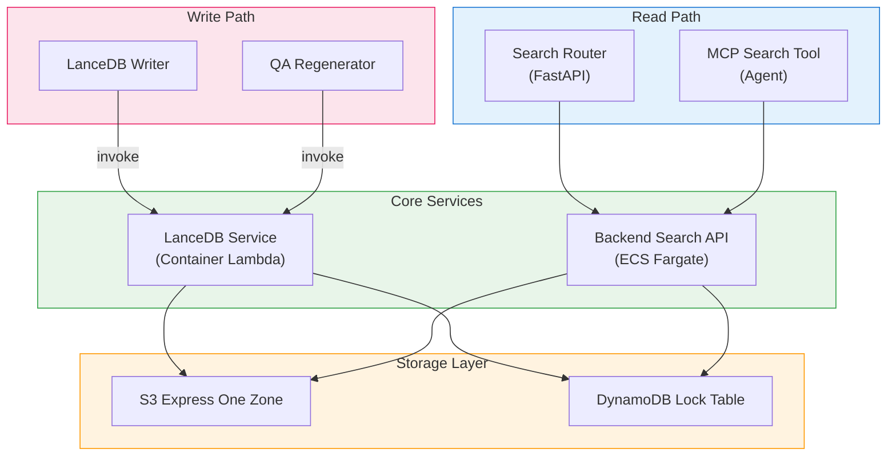

<h1 align="center">Vector Database (LanceDB + Kiwi)</h1>

<p align="center">
  <strong>서버리스 벡터 스토리지와 한국어 형태소 기반 검색</strong>
</p>
<p align="center">
  
  
  
  
  
</p>

<p align="center">
  <a href="VECTORDB_en.md">English</a> | <strong>한국어</strong> | <a href="VECTORDB_ja.md">日本語</a>
</p>

---

## 개요

이 프로젝트는 Amazon OpenSearch Service 대신 [LanceDB](https://lancedb.com/)를 벡터 데이터베이스로 사용합니다. LanceDB는 오픈소스 서버리스 벡터 데이터베이스로, 데이터를 S3에 직접 저장하며 별도의 클러스터 인프라가 필요 없습니다. 여기에 한국어 형태소 분석기 [Kiwi](https://github.com/bab2min/Kiwi)를 결합하여 한국어를 지원하는 하이브리드 검색(벡터 + 전문 검색)을 구현합니다.

### OpenSearch 대신 LanceDB를 선택한 이유

이 프로젝트는 **PoC/프로토타입**이며, 비용 효율성이 핵심 요소입니다.

| 항목 | OpenSearch Service | LanceDB (S3) |
|------|-------------------|---------------|
| 인프라 | 전용 클러스터 (최소 2~3 노드) | 클러스터 불필요 (서버리스) |
| 유휴 비용 | 미사용 시에도 과금 | S3 스토리지 비용만 발생 |
| 설정 복잡도 | 도메인 구성, VPC, 접근 정책 | S3 버킷 + DynamoDB 잠금 테이블 |
| 스케일링 | 노드 스케일링 필요 | S3와 함께 자동 확장 |
| 예상 월 비용 (PoC) | $200~500+ (t3.medium x2 최소) | $1~10 (S3 + DDB 온디맨드) |

> **참고**: OpenSearch는 대시보드, k-NN 플러그인, 세분화된 접근 제어 등 프로덕션 워크로드에 적합한 풍부한 기능을 제공합니다. 전환 가이드는 [OpenSearch 마이그레이션](#opensearch-마이그레이션)을 참고하세요.

---

## 아키텍처

```
쓰기 경로:
  Analysis Finalizer → SQS (Write Queue) → LanceDB Writer Lambda
    → LanceDB Service Lambda (Container)
        ├─ Kiwi: 키워드 추출
        ├─ Bedrock Nova: 벡터 임베딩 (1024d)
        └─ LanceDB: S3 Express One Zone에 저장

읽기 경로 (백엔드):
  Search API (FastAPI on ECS)
    ├─ Kiwi: 쿼리 키워드 추출
    ├─ LanceDB: 하이브리드 검색 (벡터 + FTS)
    └─ Bedrock Cohere Rerank v3.5: 결과 재순위화

읽기 경로 (에이전트):
  MCP Search Tool → Backend Search API → (위와 동일)
```

### 스토리지 구조

```
S3 Express One Zone (Directory Bucket)
  └─ idp-v2/
      ├─ {project_id_1}/     ← 프로젝트당 하나의 LanceDB 테이블
      │   ├─ data/
      │   └─ indices/
      └─ {project_id_2}/
          ├─ data/
          └─ indices/

DynamoDB (Lock Table)
  PK: base_uri  |  SK: version
  └─ LanceDB 테이블 동시 접근 관리
```

---

## 구성 요소

### 1. LanceDB Service Lambda (Container Image)

벡터 DB 핵심 서비스입니다. `lancedb`와 `kiwipiepy`의 합산 크기가 Lambda 배포 제한(250MB)을 초과하기 때문에 Docker 컨테이너 이미지를 사용합니다.

| 항목 | 값 |
|------|-----|
| 함수 이름 | `idp-v2-lancedb-service` |
| 런타임 | Python 3.12 (Container Image) |
| 메모리 | 2048 MB |
| 타임아웃 | 5분 |
| 베이스 이미지 | `public.ecr.aws/lambda/python:3.12` |
| 의존성 | `lancedb>=0.26.0`, `kiwipiepy>=0.22.0`, `boto3` |

**지원 액션:**

| 액션 | 설명 |
|------|------|
| `add_record` | 문서 세그먼트 추가 (키워드 추출 + 임베딩 + 저장) |
| `delete_record` | 세그먼트 ID로 삭제 |
| `get_segments` | 워크플로우의 모든 세그먼트 조회 |
| `search` | 하이브리드 검색 (벡터 + FTS) |
| `list_tables` | 전체 프로젝트 테이블 목록 |
| `count` | 프로젝트 테이블의 레코드 수 조회 |

**Container Lambda를 사용하는 이유:**

Kiwi의 한국어 언어 모델 파일과 LanceDB의 네이티브 바이너리를 합치면 수백 MB에 달하여, Lambda의 250MB zip 제한을 초과합니다. Docker 컨테이너 이미지(최대 10GB)를 사용하면 이 제약을 해결할 수 있습니다.

### 2. LanceDB Writer Lambda

분석 파이프라인에서 쓰기 요청을 받아 LanceDB Service에 위임하는 SQS 소비자입니다.

| 항목 | 값 |
|------|-----|
| 함수 이름 | `idp-v2-lancedb-writer` |
| 런타임 | Python 3.14 |
| 메모리 | 256 MB |
| 타임아웃 | 5분 |
| 트리거 | SQS (`idp-v2-lancedb-write-queue`) |
| 동시성 | 1 (순차 처리) |

동시성을 1로 설정하여 LanceDB 테이블에 대한 동시 쓰기 충돌을 방지합니다.

### 3. Backend Search API (FastAPI)

FastAPI 백엔드에서 LanceDB를 직접 조회하는 검색 엔드포인트를 제공합니다.

| 엔드포인트 | 설명 |
|------------|------|
| `GET /projects/{id}/search/segments` | 프로젝트의 전체 세그먼트 목록 |
| `GET /projects/{id}/search/hybrid` | 하이브리드 검색 (벡터 + FTS) |
| `GET /projects/{id}/search/rerank` | 하이브리드 검색 + Cohere Rerank |

### 4. MCP Search Tool

AI 채팅 중 에이전트가 문서를 검색할 때 백엔드 검색 API를 호출하는 MCP 도구입니다.

```
사용자 질의 → Bedrock Agent Core → MCP Gateway
  → Search Tool Lambda → Backend /search/hybrid → LanceDB
```

---

## 데이터 스키마

각 문서 세그먼트는 다음 스키마로 저장됩니다:

```python
class DocumentRecord(LanceModel):
    workflow_id: str            # 워크플로우 ID
    document_id: str            # 문서 ID
    segment_id: str             # "{workflow_id}_{segment_index:04d}"
    segment_index: int          # 세그먼트 페이지/챕터 번호
    content: str                # content_combined (임베딩 소스 필드)
    vector: Vector(1024)        # Bedrock Nova 임베딩 (벡터 필드)
    keywords: str               # Kiwi 추출 키워드 (FTS 인덱싱)
    file_uri: str               # 원본 파일 S3 URI
    file_type: str              # MIME 타입
    image_uri: Optional[str]    # 세그먼트 이미지 S3 URI
    created_at: datetime        # 생성 시각
```

- **프로젝트당 하나의 테이블**: 테이블 이름 = `project_id`
- **`content`**: 모든 전처리 결과를 합친 텍스트 (OCR + BDA + PDF 텍스트 + AI 분석)
- **`vector`**: LanceDB 임베딩 함수로 자동 생성 (Bedrock Nova, 1024차원)
- **`keywords`**: Kiwi로 추출한 한국어 형태소 (FTS 인덱스)

---

## Kiwi: 한국어 형태소 분석기

[Kiwi (Korean Intelligent Word Identifier)](https://github.com/bab2min/Kiwi)는 C++로 작성된 오픈소스 한국어 형태소 분석기이며, Python 바인딩(`kiwipiepy`)을 제공합니다.

### Kiwi를 사용하는 이유

LanceDB의 내장 FTS 토크나이저는 한국어를 지원하지 않습니다. 한국어는 교착어로 공백만으로 단어를 분리할 수 없습니다. 예시:

```
입력:  "인공지능 기반 문서 분석 시스템을 구축했습니다"
Kiwi:  "인공 지능 기반 문서 분석 시스템 구축"  (명사만 추출)
```

형태소 분석 없이는 "시스템"으로 검색할 때 "시스템을" 또는 "시스템에서"가 포함된 문서를 찾을 수 없습니다.

### 추출 규칙

| 품사 태그 | 설명 | 예시 |
|-----------|------|------|
| NNG | 일반 명사 | 문서, 분석, 시스템 |
| NNP | 고유 명사 | AWS, Bedrock |
| NR | 수사 | 하나, 둘 |
| NP | 대명사 | 이것, 그것 |
| SL | 외국어 | Lambda, Python |
| SN | 숫자 | 1024, 3.5 |
| SH | 한자 | |
| XSN | 접미사 | 이전 토큰에 결합 (예: 생성+형 → 생성형) |

**필터:**
- 1글자 한국어 불용어: 것, 수, 등, 때, 곳
- 1글자 외국어, 숫자, 한자는 보존

---

## 하이브리드 검색 흐름

```
검색 쿼리: "문서 분석 결과 조회"
  │
  ├─ [1] Kiwi 키워드 추출
  │     → "문서 분석 결과 조회"
  │
  ├─ [2] 벡터 검색 (의미 기반)
  │     → Bedrock Nova 임베딩 → 코사인 유사도
  │     → Top-K 결과 (_distance 점수)
  │
  ├─ [3] 전문 검색 (키워드 기반)
  │     → FTS 인덱스에서 키워드 매칭
  │     → Top-K 결과 (_score)
  │
  ├─ [4] 병합 및 중복 제거
  │     → 벡터 + FTS 결과 합집합
  │
  └─ [5] 리랭킹 (선택)
        → Bedrock Cohere Rerank v3.5
        → 최종 Top-N 결과 (rerank_score)
```

---

## 인프라 (CDK)

### S3 Express One Zone

```typescript
// StorageStack
const expressStorage = new CfnDirectoryBucket(this, 'LanceDbExpressStorage', {
  bucketName: `idp-v2-lancedb--use1-az4--x-s3`,
  dataRedundancy: 'SingleAvailabilityZone',
  locationName: 'use1-az4',
});
```

S3 Express One Zone은 한 자릿수 밀리초 지연 시간을 제공하며, 벡터 검색과 같은 빈번한 읽기/쓰기 패턴에 최적화되어 있습니다.

### DynamoDB Lock Table

```typescript
// StorageStack
const lockTable = new Table(this, 'LanceDbLockTable', {
  partitionKey: { name: 'base_uri', type: AttributeType.STRING },
  sortKey: { name: 'version', type: AttributeType.NUMBER },
  billingMode: BillingMode.PAY_PER_REQUEST,
});
```

여러 Lambda 함수가 동일한 데이터셋에 동시 접근할 때 분산 잠금을 관리합니다.

### SSM 파라미터

| 키 | 설명 |
|----|------|
| `/idp-v2/lancedb/lock/table-name` | DynamoDB 잠금 테이블 이름 |
| `/idp-v2/lancedb/express/bucket-name` | S3 Express 버킷 이름 |
| `/idp-v2/lancedb/express/az-id` | S3 Express 가용 영역 ID |

---

## 컴포넌트 의존성 맵

LanceDB에 의존하는 모든 컴포넌트를 나타낸 다이어그램입니다:



| 컴포넌트 | 스택 | 접근 유형 | 설명 |
|----------|------|-----------|------|
| **LanceDB Service** | WorkflowStack | 읽기/쓰기 | 핵심 DB 서비스 (Container Lambda) |
| **LanceDB Writer** | WorkflowStack | 쓰기 (Service 경유) | SQS 소비자, Service에 위임 |
| **Analysis Finalizer** | WorkflowStack | 쓰기 (SQS/Service 경유) | 세그먼트를 쓰기 큐로 전송, 재분석 시 삭제 |
| **QA Regenerator** | WorkflowStack | 쓰기 (Service 경유) | Q&A 세그먼트 업데이트 |
| **Backend Search API** | ApplicationStack | 읽기 | FastAPI 하이브리드 검색 엔드포인트 |
| **MCP Search Tool** | McpStack | 읽기 (Backend 경유) | 에이전트 문서 검색 도구 |

---

## OpenSearch 마이그레이션

프로덕션 환경에서 Amazon OpenSearch Service로 전환 시, 다음 컴포넌트를 수정해야 합니다.

### 교체 대상 컴포넌트

| 컴포넌트 | 현재 (LanceDB) | 변경 후 (OpenSearch) | 범위 |
|----------|----------------|---------------------|------|
| **LanceDB Service Lambda** | Container Lambda + LanceDB | OpenSearch 클라이언트 (CRUD + 검색) | 전체 교체 |
| **LanceDB Writer Lambda** | SQS → LanceDB Service 호출 | SQS → OpenSearch 인덱스 쓰기 | 호출 대상 교체 |
| **Backend `lancedb.py`** | `lancedb.connect(s3+ddb://...)` | OpenSearch 클라이언트 연결 | 교체 |
| **Backend `search.py`** | LanceDB 하이브리드 검색 API | OpenSearch k-NN + 전문 검색 쿼리 | 검색 로직 교체 |
| **Backend `keywords.py`** | Kiwi 키워드 추출 | OpenSearch Nori 분석기 (내장) | 제거 가능 |
| **Backend `embedding.py`** | LanceDB 임베딩 함수 | OpenSearch neural search / ingest pipeline | 교체 |
| **StorageStack** | S3 Express + DDB 잠금 테이블 | OpenSearch 도메인 (VPC) | 리소스 교체 |

### 변경 불필요 컴포넌트

| 컴포넌트 | 이유 |
|----------|------|
| **Analysis Finalizer** | SQS에 메시지만 전송 (큐 인터페이스 불변) |
| **MCP Search Tool** | 백엔드 HTTP API 호출 (API 계약 불변) |
| **Frontend** | 백엔드 검색 API 사용 (DB 직접 접근 없음) |
| **Step Functions Workflow** | LanceDB 직접 의존성 없음 |

### 마이그레이션 전략

```
Phase 1: 스토리지 계층 교체
  - VPC 내에 OpenSearch 도메인 생성
  - StorageStack 리소스 교체 (S3 Express + DDB 잠금 제거)
  - 한국어 토큰화를 위한 Nori 분석기 설정

Phase 2: 쓰기 경로 교체
  - LanceDB Service → OpenSearch 인덱싱 서비스로 변경
  - 문서 스키마 변경 (OpenSearch 인덱스 매핑)
  - 임베딩을 위한 OpenSearch neural ingest pipeline 추가

Phase 3: 읽기 경로 교체
  - Backend search.py → OpenSearch k-NN + 전문 검색 쿼리로 변경
  - Kiwi 의존성 제거 (Nori가 한국어 토큰화 처리)
  - 리랭킹 통합 업데이트

Phase 4: LanceDB 의존성 제거
  - requirements에서 lancedb, kiwipiepy 제거
  - Container Lambda 제거 (일반 Lambda로 전환 가능)
  - S3 Express 버킷 및 DDB 잠금 테이블 제거
```

### 주요 고려 사항

| 항목 | 내용 |
|------|------|
| 한국어 토큰화 | OpenSearch에는 [Nori 분석기](https://opensearch.org/docs/latest/analyzers/language-analyzers/#korean-nori)가 내장되어 있어 Kiwi 제거 가능 |
| 벡터 검색 | OpenSearch k-NN 플러그인 (HNSW/IVF)이 LanceDB 벡터 검색을 대체 |
| 임베딩 | OpenSearch neural search로 ingest pipeline에서 자동 임베딩 가능, 또는 사전 계산된 임베딩 사용 |
| 비용 | OpenSearch는 실행 중인 클러스터 필요. HA를 위한 최소 2노드 클러스터 |
| SQS 인터페이스 | SQS 쓰기 큐 패턴은 유지 가능, 소비자 로직만 변경 |

---

## 라이선스

이 프로젝트는 [Amazon Software License](../../LICENSE)의 하에 라이선스됩니다.
